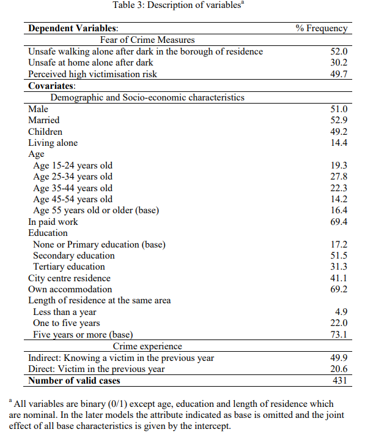
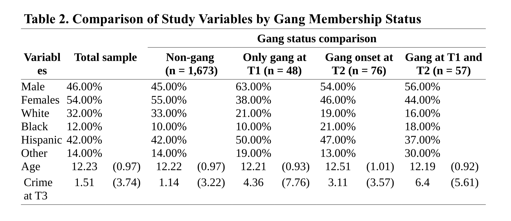

# Wrapping up

It is the final week, so let me start with some general reflections to wrap up the unit. I know some of you may think, why the hell am I learning code and stats? You may think the contents of this course may ultimately not be of direct benefit to you. But we have designed this experience in such a way that you also acquire a set of skills and tools to learn how to confront tough problems (even those you may think you hate). Life will throw many of those kind of problems at your door. Having survived this module, we believe may have also teach you a thing or two about the importance of task persistence; overcoming your frustration in order to obtain results; dealing with your own insecurites and the understandable emotions they generate; being more organised about your work; collaborate with others in the same situation; the importance of attention to detail; etc. Hopefully we may have also helped you to develop a greater sense of curiosity and to achieve the inmense satisfaction one gets when one cracks a tough problem that may have had us screaming at the computer screen for what may have felt like hours. We know a course like this may get you out of your comfort zone. But we firmly believe that it is worth it. And that you will get something out of it, even if now may not be terribly obvious to you.

And with that, let's move to this final session. We are not going to cover new techniques today. What there may be a few tips about presentation that you may find helpful. The document in Blackboard about how to write your analytical report is quite detailed already. But there a few additional tips you may find helpful. 

##Tips for the assignment

You should all now be familiar with the assignment you have to do. In the Blackboard page for this course unit you can obtain the essay question and additional guidance we have prepared. You can see as well [here](https://github.com/jjmedinaariza/modelling_book/blob/master/files_docs/STEPS%20IN%20THE%20ANALYSIS%20REQUIRED%20FOR%20THE%20ESSAY.pdf). This guidance aims to answer most of the questions about what you need to do and how. It is very detailed and it has been built with the feedback from the many students that have taken this module before. That guidance aims to provide you a helping hand during the process. It also includes a file in how to think about the writing of your essay -see [here](https://github.com/jjmedinaariza/modelling_book/blob/master/files_docs/WRITING%20THE%20ESSAY.pdf).

Critically you have never written anything like this before so it is normal to have questions. It may help you to read any article in any of the top journals in our field such as [Criminology](https://onlinelibrary.wiley.com/journal/17459125), the [Journal of Research in Crime and Delinquency](https://journals.sagepub.com/home/jrc), or if you like "hard drugs" the [Journal of Quantitative Criminology](https://link.springer.com/journal/10940) to get an idea of the templates that criminologists follow when writing a research report. **Looking at good templates** such as the ones you will encounter in those journals will give you good ideas about how to tell your story. Keep in mind those journal articles are subject to a more generous word count than you will have here, so you will have to be even more succint and parsimonious. If you are spoiled by choice and hesitant about which paper to choose, have a look at [this one](https://onlinelibrary.wiley.com/doi/10.1111/j.1745-9125.2011.00227.x) by Chris Melde and Finn Esbensen from 2009.

For any additional questions you can follow the sequential 5 "Bs" approach designed to enhance autonomy that primary schools follow these days: brain, book, board, buddy, boss. Start with the first and move to the next one if you get stuck.

 

+ **Brain**: "Do you already know the answer or is this something you can decide for yourself?"
+ **Book**: "Can I look back through my learning materials and find the answer there?"
+ **Board**: "Is the answer in the discussion board?"
+ **Buddy**: "Can one of my peers answer this question?" (if unconvinced by their answer you can move to the next B)
+ **Boss**: "If I have tried all the other Bs, then I can put up my hand but continue working" (and remember here you should first try to ask in the discussion board or the labs, and failing that make an appointment through office hours)

A scientific report, like the one you are tasked to write, needs to be clear, well justified, and very efficient in the use of space. It will be helpful you finish ahead of time and **dedicate some time simply to edit your final essay**. This is, in fact, a general piece of advice for any essay you write. But in this case perhaps matters more. You will have done loads of things as part of your analysis, but will have very limited word count to tell the story of your analysis. Every word and every sentence must be needed. There is always a shorter and more parsimonious way of saying something! And, please, use the spelling editors of whatever app you use to write your essays. It is not cool to send essays with typos and grammar errors that any app can automatically detect these days.

Here I am just going to cover a few things you can do to make this presentation a bit more succint and parsimonious.

##Summarising your variables

The paper by Melde and Esbensen (2009) cited above provides an example of how you may want to describe in the text your variables. As noted you may not have as much space to get into so much detail, but the core idea you need to take home is that the reader needs to know what variables you are using and how they are measured. You will also need to provide a succint summary of the descriptive measures for your variables. Look at [this paper](https://journals.sagepub.com/doi/10.1177/1477370808095123) by Andromachi Tseloni and Christina Zarafonitou (2008). Below I reproduce a table from the pre-print version of this article with a summary of the variables they are using in their analysis:

 

This is a very succint way of describing the distribution of your variables when all are categorical. If you happen to have quantitative variables as well you could, for example, add another column with the mean and the standard deviation (the latter enclosed in brackets) -which would only have this information for your quantitative variables.

Notice that this table has minimum amount of ink and only lines separating cells when absolutely necessary. If you are uncertain how to modify the default tables your word editor uses, [this file](https://github.com/jjmedinaariza/modelling_book/blob/master/files_docs/wordtables.pdf) gives you some tips in how to do with with MS Word. It will be fairly similar with other apps.

Notice as well that information about the total sample size is provided. Remember what we cover in the end of section 4.9!

As we have said we want you to look at whether your variables are associated before you run your multiple regression model. We do this so that we can evaluate if you have learnt how to choose the right tests and measures of effect size. 

 

Above I am reproducing an example of how you could do this. The example assumes you have a categorical dependent variable with four different categories (non-gang, gang only at T1, etc.). You can see how in this table the categories define the column (there is also one for the total sample, if you have something like this you are essentially providing also the summary descriptive for the whole). You can see that the rows define the levels for two categorical variables (gender and race/ethnicity) and two quantitative variables (age and a score for crime). For the categorical variables we have the appropriate percentages (as discussed in week 7) and for the quantitative variables we have the means and standard deviations. Remember how you set this table may differ depending the nature of your variables, but hopefully you get the idea. You can find a way to summaries the information. You could add a column to a table like this with the p values for your statistical tests (somehow indicating what that test was: chi square, F, etc.). Then you could discuss the more relevant of this in the narrative discussing your table.

##Some final words

So, this is the end. At least for now. What we have done this semester is an introduction to the field of data analysis. But there is so much more to it. If you are planning a scientific career or want to work as an analyst in the private or public sector, the journey is just beginning. 

But there are many free courses offered as massive online open courses that you could take to consolidate or further expand what you have learnt this semester. Check out [Coursera](https://www.coursera.org/browse/data-science) or [edX](https://www.edx.org/course/subject/data-science) platforms for these. Many of those courses make you pay for a certificate (and if you want to get feedback), but you can watch the videos and use the materials for free in almost all of them. You may also want to have a look at [datacamp](https://www.datacamp.com). Most of their courses require a paid subscription, but there are many courses for free (particularly those created by the community).

Good luck with the final assignment! And do not hesitate to get in touch if you have any queries.
