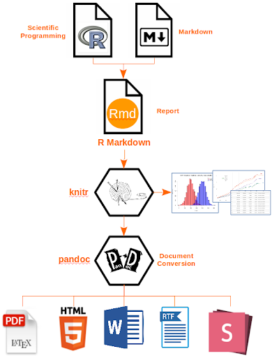
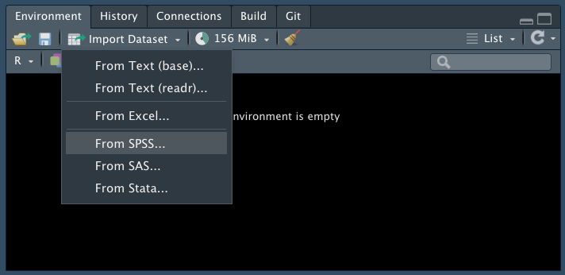
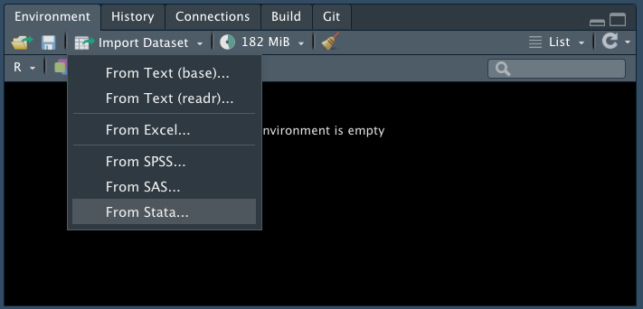

# Homework Activities

## General instructions

In the first week session, we talked about why we need to conduct research in reproducible manner. It facilitates transparency in research process, increases public re-usability of scientific evidence, and promotes scientific collaboration.`Rmarkdown` documents are reproducible and supports various output formats such as pdf, html, and docx. `Rmarkdown` is simply combine your R codes, documents your data analysis into a reproducible document and format.



For all activities you are expected to produce html files with the discussed answers and the relevant code. You need to generate a Rmarkdown document and use `knitr` to generate the **html** file with your answer. Create one html file for each weekly submission. [This video](https://www.youtube.com/watch?v=-apyD5f9nwg) explains how to do this. The video uses an earlier version of `Rmarkdown`, so you will notice that when you create a new markdown file instead a dialogue box open (select html) but everything else pretty much remains the same. In any case, you can find further details about `Rmarkdown` [here](http://rmarkdown.rstudio.com/) or in this [very detailed tutorial](http://galahad.well.ox.ac.uk/repro/?utm_content=bufferc4efb&utm_medium=social&utm_source=twitter.com&utm_campaign=buffer). [This guide](http://stat545-ubc.github.io/block007_first-use-rmarkdown.html#troubleshooting), produced for a different course unit, helps you to test drive and troubleshoot common problems. Although it may take you a while to get used to produce your homework in this way, in the long run you will see the benefits.

You have to include all codes you use for the home works. Once you knit to a html file, you need to upload the file to TurnitIn through Blackboard before the next session (e.g., week 1 homework deadline is 'before Week 2 lab session')

## Week 1 Homework: Basic Data Exploration and Filtering

**Exercise 1**
Load the classic [`Guerry`](https://en.wikipedia.org/wiki/Andr%C3%A9-Michel_Guerry) data available from the `Guerry` package. Hint: see the lab note 1.13 Dataframes. We got 'hate_crimes' data from the 'fivethirtyeight' package.

1) How many variables and cases does this data have? Hint: `dim()`
2) What are the names of the variables? Hint: `names()`
3) What does the variable `Prostitutes` measures? Hint: `help()`
4) Produce a simple histogram of the `Crime_pers` variable. Any discernible patterns? Interpret and discuss your results. Hint: `Hist()`
5) Produce summary statistics of the `Crime_pers` variable by `Region`. Any discernible patterns? Interpret and discuss your results. Hint: see the lab note 2.7. 

**Exercise 2**
Acquire the “NCVS” data from blackboard under the data for week 1. Download this into your working directory, into a data sub-folder if you have one. Import the data into R (Use 'Import Dataset' in the environment window. Select 'From SPSS'.). Name the dataframe object ‘ncvs’.



1) Now explore your data with some of the functions we learned in the lab today. How many observations are in the dataframe? How many variables?
2) What are the possible values for the injured variable in the ncvs dataframe? What do these tell you? Hint: look for how to find labels. 
3) I made a frequency table for the injured variable using the code `table(ncvs$injured)`. I received the output names as `0` and `1`. How can I make them as `uninjured` and `injured`? Hint:`as_factor()`

**Exercise 3**
Acquire the “ukpolice” data from blackboard under the data for week 1. The data has information of 'the number of police officer in each police force (UK)' in 2016. You can find the relevant information [here](https://en.wikipedia.org/wiki/List_of_police_forces_of_the_United_Kingdom). (Use 'Import Dataset' in the environment window. Select 'From Stata'. You will learn how to import data in the later weeks using R codes. Here, just try to remember R can import different types of data in various ways).


1) What was the mean number of police officers in all police forces? 
2) Using the 'filtering' methods described compute the mean and standard deviation for the four largest forces and compare it with the mean and the standard deviation of the remainder police forces. Hint: see lab note 2.5. and use the 'top4' variable.


## Week 2 Homework: Data visualisations with R

Download from the GitHub repository the following dataset `crossnat.csv`. You url for the dataset is: https://raw.githubusercontent.com/eonk/dar_book/main/datasets/crossnat.csv

Look at the instructions for how to download files from the web that we provided in Week 1. This comma-separated value file contains a number of variables about 194 countries. This data is collected for teaching purposes in January 2014. The information comes from a variety of sources (World Bank, United Nations, OCDE, etc) and it relates to the more recent year for which data was available then.

Sometimes students experience problems when downloading files within a Rmarkdown file. If you are getting stuck you may try an alternative. First get the file in your hard-drive using the console or a script (not Rmarkdown):

**step 1** Download the file into your global environment as covered in week 1;  
**step 2** Save the file into your hard-drive, for example write.csv(crossnat, "crossnat.csv") to save it as .csv in your working directory;    
**step 3** Then read the data from your working directory into rmarkdown (e.g., using the `read.csv()` function)     

Ok, these are the questions:

1) Display a histogram for the prison rate per 100,000 population (`prisonrate`). Interpret and discuss your results. Can you identify any outliers? Are these errors? Are there plausible explanations for the extreme values in these countries?    
2) Produce density estimates and boxplots to compare the prison rate according to various categories of the level of [human development](http://hdr.undp.org/en/content/human-development-index-hdi) per country (use 'cathid'). Interpret and discuss your results.      
3) Produce a scatter plot with a smoothed line to examine the relationship between `prisonrate` and `gdppercapita`. Interpret and discuss your results.    
4) Produce a scatterplot matrix to examine the relationship between `prisonrate`, `gdppercapita`, `urbanpop` (proportion of the population that lives in urban areas) and `homicide`(homicide per 100,000). Interpret and discuss your results.     

## Week 3 Homework: Foundations for inference (confidence intervals)

Download the following dataset `Seattle_Neighborhoods_Crime_RandomSample_dar.dta` from Blackbord and import the data into R. Get to know your data, specifically how many variables and observations and what the data were collected for and how the data were collected. It is always good practice to understand the data you use. For information on the methodology (including data collection procedure), see: [Seattle Neighborhoods and Crime Survey, 2002-2003 (umich.edu)](https://www.icpsr.umich.edu/web/ICPSR/studies/28701/summary)

I created a new variable `neigh_sd` composing variables from variables Q14A to Q14E, which shows 'the level of neighbourhood social disorganisation'  
1) Use the `t.test()` function to calculate 95% confidence interval of the mean for `neigh_sd`. How would you interpret the values? 
2) Now calculate 99% confidence intervals of the mean for `neigh_sd`. How are these values different to that of the 95% confidence intervals? Why do you think that is?  

Let’s look at another variable, of whether the respondent reported an incidence of theft to the police. This variable is called `Q61E_f` in your data. Use the `attributes()` function to learn about the variable. (Hint: Remember this is a categorical variable so you need to transform the data into a 'factor' variable).
1) What percentage of respondents who answered this question with Yes or No reported their theft to the police?
2) Calculate 95% confidence intervals around this value (hint: look for the `prop.table()` function in the lab notes). What does this tell you? Interpret this in your own words below.

## Week 4: Hypothesis tests (comparing means)

For this exercise you need to download a dataset available in the [UK Data Archive](http://www.data-archive.ac.uk/). The dataset belongs to an old study comparing treatments for juvenile offenders. You can find out more details about it [here](http://discover.ukdataservice.ac.uk/catalogue/?sn=3168&type=Data%20catalogue). Make sure you read the User Guide and the Codebook at the bottom of the page. We are going to try to reproduce the results obtained by the researchers. In order to be able to download data from this repository you have to first register with it. To do so follow the instructions [here](http://ukdataservice.ac.uk/get-data/how-to-access/registration.aspx) and then follow the [instructions for downloading data](http://ukdataservice.ac.uk/get-data/how-to-access/downloadorder.aspx). Why so many loops? This will teach you how to use this most valuable resource. This repository is full of data you can use for your own purposes, including the full version of the Crime Survey of England and Wales. When downloading the file you will be given the choice of different formats. Save the file in .tab delimited format. Then you could adapt the code below to read it into R.


```r
Kingswood <- read.table("g168.tab", sep="\t", header=TRUE)
```

You will need to look at the Codebook to understand the meaning of the variable names and what they are measuring. But know that the `HOUSE` variable identifies the treatment condition. The class 2 corresponds to the comparison group and the class 3 corresponds to the experimental group. Notice however that this is an integer vector, so you will need to redefine it as a factor in order to be able to use it in your tests.

BEWARE: if you do not pay close attention to the codebook there is a very good chance you will get the wrong answers below. Exploring the data beforehand can also help you to identify things you may have to do before running your hypothesis test.

1) Is there a relationship between the experimental treatment and number of court appearances after release? Interpret and discuss your results.
2) Is there a relationship between the experimental treatment and the seriousness score of the first offence after release? Interpret and discuss your results.
3) Consider now whether including the third site in the study (House 1) allows us to see any differences in recidivism using the two outcome measures used so far. Interpret and discuss your results.
4) Is there a relationship between criminal record of parents and number of court appearances after release? Interpret and discuss your results.
